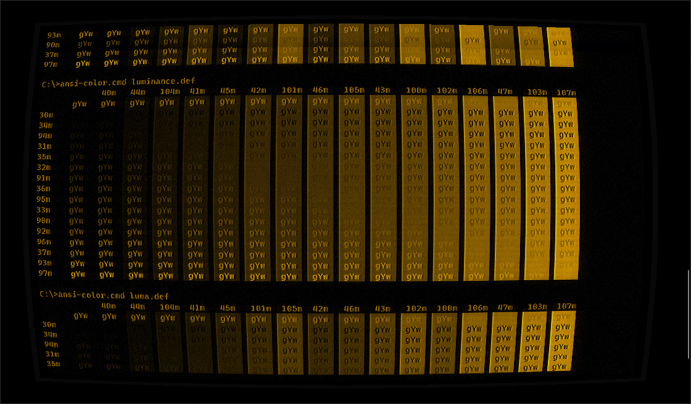
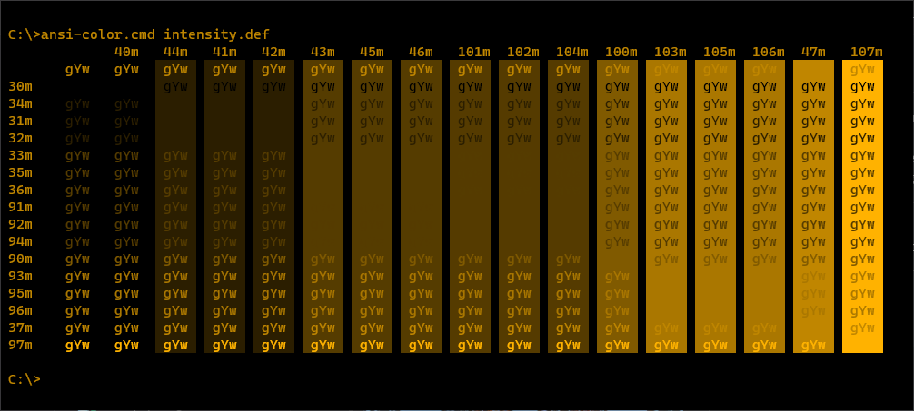
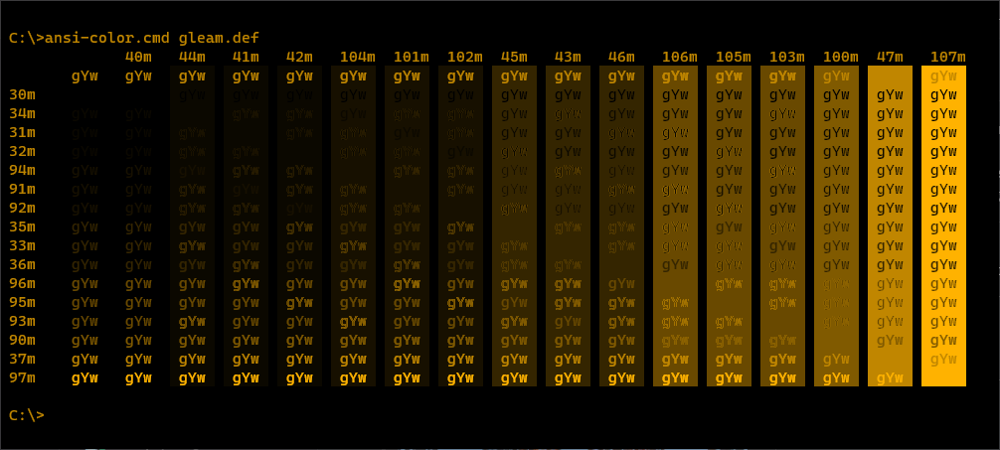
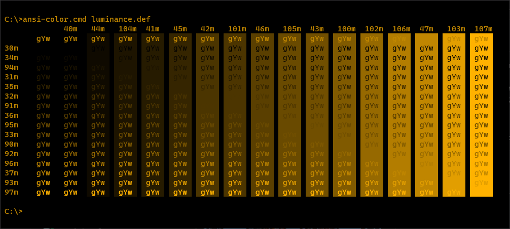

# Windows Terminal Shaders

Shaders for the new Windows Terminal

## How to use

- Checkout the repository
- Set the value for `experimental.pixelShaderPath` in your terminal setting to the desired shader
- **optional:** Add keybindings for turning the shader on/off and focusmode

### Example Setting

> Please add the lines you need to your own config, this example config only show the values that you need to add.

```jsonc
{
  "profiles": {
    "defaults": {
      // Add your desired shader
      "experimental.pixelShaderPath": "C:\\gitrepos\\windows-terminal-shaders\\crt.hlsl"
    },
  },
  "keybindings": [
    // It's recommended to add those two toggles for ease of use
    {
      "command": "toggleFocusMode",
      "keys": "shift+f11"
    },
    {
      "command": "toggleShaderEffects",
      "keys": "shift+f10"
    }
  ]
}
```

## [CRT](./crt.hlsl)

### Preview
|||||
|---|---|---|---|
|Default|Green Monochrome|Ember Monochrome|With Luminance, Grayscale, Tint, Grain, Refresh, Scanlines, Bloom, Blur, and Curve|

### Grayscale conversion
||||
|---|---|---|
|Vintage Color Scheme|Default without Grayscale conversion|Intensity Strategy †|

||||
|---|---|---|
|Gleam Strategy †|Luminance Strategy †|Luma Strategy †|

† The order of [SGR ANSI Escape Codes](https://en.wikipedia.org/wiki/ANSI_escape_code#Colors) have been adjusted to demonstrate a smooth transition from dark to light, but the order will change because there is no perfect way to convert color to grayscale. There are advantages and disadvantages of all strategies.

-----

#### Regarding Retro.hlsl license
This shader takes advantage of some of the techniques showcased in [Retro.hlsl](https://github.com/microsoft/terminal/blob/fb597ed304ec6eef245405c9652e9b8a029b821f/samples/PixelShaders/Retro.hlsl), for applying scanlines. These changes are MIT License and so therefore not being committed to the main branch until licensing needs can be addressed. This branch is so that these changes can be maintained and tracked until this can be resolved.

-----

### Settings
When using a monochorme tint, there should be some considerations made. The Vintage color scheme is probably the best choice for trying to capture a nostalgic feel. Other color schemes, while still being monochormatic will have different brightness levels which may not correspond with expectations. If ENABLE_GRAYSCALE is used, there are four different strategies, one of which should be selected. Intensity, Gleam, Luminance, and Luma are calculated using the formulas on this [Color-to-Grayscale](https://journals.plos.org/plosone/article?id=10.1371/journal.pone.0029740) paper. While there isn't a perfect conversion technique, and the results change considerably depending on the color scheme used, Luminance seems to provide the smoothest transitions using Vintage as the base. It is also recommended that the Windows Terminal [fontFace](https://docs.microsoft.com/en-us/windows/terminal/customize-settings/profile-appearance#font-face) and [antialiasingMode](https://docs.microsoft.com/en-us/windows/terminal/customize-settings/profile-advanced#text-antialiasing) settings are adjusted to improve readability as desired. Lastly, this is applying a pixel shader to the entire window. Depending on the system hardware and the size of the screen, this might be a very expensive shader to apply at max settings.

`ENABLE_CURVE`       : Draws the monitor frame and gives the illusion of rendering on a curved glass CRT.  
`ENABLE_OVERSCAN`    : Adds an overscan buffer to the display so that the content isn't right up against the edges. This improves the ability to see the cursor when it is a bar.  
`ENABLE_BLOOM`       : Enhances the leading edge of a change in the electron beam. An artifact of how older CRTs drew, but in some cases it helps increase contrast and helps improve readability.  
`ENABLE_BLUR`        : Causes the brigher phosphors to bleed some light into neighboring areas similar to the glass on old CRTs.  
`ENABLE_GRAYSCALE`   : Converts the color to monochrome. Probably most useful when used with ENABLE_TINT.  
`ENABLE_REFRESHLINE` : Introduces a refresh artifact, simulating when the refresh is slightly out of sync.  
`ENABLE_SCANLINES`   : Adds hard raster lines to the display output to simulate each scanline.  
`ENABLE_TINT`        : Used with ENABLE_GRAYSCALE to simulate amber or green phosphor monochrome monitors. It can also apply a warm or cool tint to shift the colors slightly more red or slightly more blue.  
`ENABLE_GRAIN`       : Adds a low intensity white noise snow to the screen to simulate the static of an analog signal.  
`ENABLE_BLACKLEVEL`  : Raises the blacklevel floor. Especially old monochrome CRTs still illuminated some phosphors when showing black. This controls how black the black color is displayed.  

```c++
// Shader Options
#define ENABLE_CURVE            1
#define ENABLE_OVERSCAN         1
#define ENABLE_BLOOM            1
#define ENABLE_BLUR             1
#define ENABLE_GRAYSCALE        1
#define ENABLE_REFRESHLINE      1
#define ENABLE_SCANLINES        1
#define ENABLE_TINT             1
#define ENABLE_GRAIN            1
#define ENABLE_BLACKLEVEL       1
```

```c++
// Settings - Overscan
#define OVERSCAN_PERCENTAGE     0.02

// Settings - Bloom
#define BLOOM_OFFSET            0.0015
#define BLOOM_STRENGTH          0.8

// Settings - Blur
#define BLUR_MULTIPLIER         1.05
#define BLUR_STRENGTH           0.3
#define BLUR_OFFSET             0.003

// Settings - Grayscale
#define GRAYSCALE_INTENSITY     0
#define GRAYSCALE_GLEAM         0
#define GRAYSCALE_LUMINANCE     1
#define GRAYSCALE_LUMA          0

// Settings - Blacklevel
#define BLACKLEVEL_FLOOR        TINT_COLOR / 40

// Settings - Tint
// Colors variations from https://superuser.com/a/1206781
#define TINT_COLOR              TINT_AMBER

#define TINT_AMBER              float3(1.0, 0.7, 0.0) // P3 phosphor
#define TINT_LIGHT_AMBER        float3(1.0, 0.8, 0.0)
#define TINT_GREEN_1            float3(0.2, 1.0, 0.0)
#define TINT_APPLE_II           float3(0.2, 1.0, 0.2) // P1 phosphor
#define TINT_GREEN_2            float3(0.0, 1.0, 0.2)
#define TINT_APPLE_IIc          float3(0.4, 1.0, 0.4) // P24 phpsphor
#define TINT_GREEN_3            float3(0.0, 1.0, 0.4)
#define TINT_WARM               float3(1.0, 0.9, 0.8)
#define TINT_COOL               float3(0.8, 0.9, 1.0)

// Settings - Gain
#define GRAIN_INTENSITY         0.02
```

## [Transparent](./transparent.hlsl)

Turn a specific color into transparent for use with `useAcrylic` and `acrylicOpacity` when xterm colors are enabled, like in vim themes.

### Preview
|||
|---|---|
|xterm colors without shader|xterm colors with shader|

### Settings

Set the color value for the chromaKey used for transparency `float3(8.0f / 0xFF, 8.0f / 0xFF, 8.0f / 0xFF)` is the same as `rgb(8, 8, 8)` 

```c++
static const float3 chromaKey = float3(8.0f / 0xFF, 8.0f / 0xFF, 8.0f / 0xFF);
```

## [Hue Shift](./hueshift.hlsl)

Changes the hue of screen colors. This can apply a color correction similar to the tint knob of old TVs or it can be set to cycle the colors smoothly over time.

### Preview
|||
|---|---|
|vintage colors without shader|vintage colors with shader|

### Settings

`HUE_OFFSET`  [0.0, 1.0)f : Adjust the hue to a specific offset.  
`CHANGE_RATE` [0.0, 1.0)f : Changes the hue over time. For small values like 0.01f, this will cause a slow change over time and probably won't be very disruptive.  
`TOLERANCE`   [0.0, 1.0)f : Saturation% setpoint. All saturation levels greater or equal than this will be affected by the hue adjustments. This allows you to fix some of the grayscale colors such as those offten used by on-screen text.

```c++
#define HUE_OFFSET 0.0f
#define CHANGE_RATE 0.01f
#define TOLERANCE 0.266f
```
