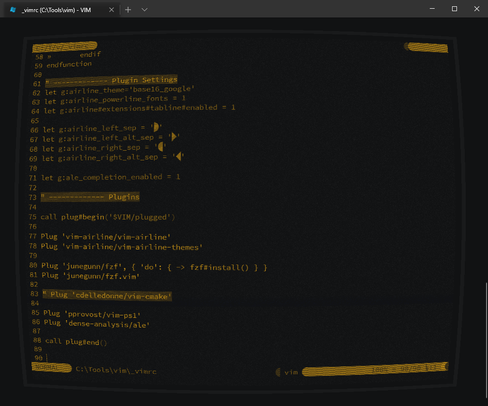

# Windows Terminal Shaders

Shaders for the new Windows Terminal

## How to use

- Checkout the repository
- Set the value for `experimental.pixelShaderPath` in your terminal setting to the desired shader
- **optional:** Add keybindings for turning the shader on/off and focusmode

### Example Setting

```jsonc
{
  "profiles": {
    "defaults": {
      // Add your desired shader
      "experimental.pixelShaderPath": "C:\\gitrepos\\windows-terminal-shaders\\crt.hlsl"
    },
  }
    "keybindings": [
    // It's recommended to add those two toggles for ease of use
    {
      "command": "toggleFocusMode",
      "keys": "shift+f11"
    },
    {
      "command": "toggleShaderEffects",
      "keys": "shift+f10"
    }
  ]
}
```

## [CRT](./crt.hlsl)

### Preview
||||
|---|---|---|
|Default|Green Monochrome|Ember Monochrome|

### Settings
```c++
#define GRAIN_INTENSITY 0.02
#define TINT_COLOR float4(1, 0.7f, 0, 0)
#define ENABLE_SCANLINES 1
#define ENABLE_REFRESHLINE 1
#define ENABLE_NOISE 1
#define ENABLE_CURVE 1
#define ENABLE_TINT 0
#define DEBUG 0
```

## [Transparent](./transparent.hlsl)

Turn a specific color into transparent for use with `useAcrylic` and `acrylicOpacity` when xterm colors are enabled, like in vim themes.

### Preview
|||
|---|---|
|xterm colors without shader|xterm colors with shader|

### Settings

Set the color value for the chromaKey used for transparency `float3(8.0f / 0xFF, 8.0f / 0xFF, 8.0f / 0xFF)` is the same as `rgb(8, 8, 8)` 

```c++
static const float3 chromaKey = float3(8.0f / 0xFF, 8.0f / 0xFF, 8.0f / 0xFF);
```
