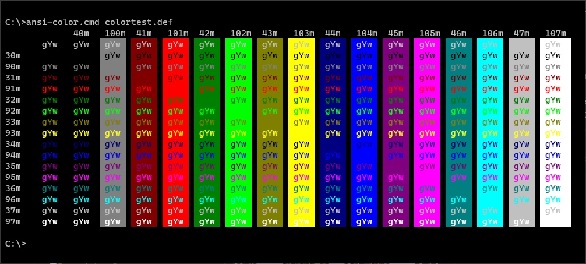

# Windows Terminal Shaders

Shaders for the new Windows Terminal

## How to use

- Checkout the repository
- Set the value for `experimental.pixelShaderPath` in your terminal setting to the desired shader
- **optional:** Add keybindings for turning the shader on/off and focusmode

### Example Setting

> Please add the lines you need to your own config, this example config only show the values that you need to add.

```jsonc
{
  "profiles": {
    "defaults": {
      // Add your desired shader
      "experimental.pixelShaderPath": "C:\\gitrepos\\windows-terminal-shaders\\crt.hlsl"
    },
  },
  "keybindings": [
    // It's recommended to add those two toggles for ease of use
    {
      "command": "toggleFocusMode",
      "keys": "shift+f11"
    },
    {
      "command": "toggleShaderEffects",
      "keys": "shift+f10"
    }
  ]
}
```

## [CRT](./crt.hlsl)

### Preview
|||||
|---|---|---|---|
|Default|Green Monochrome|Ember Monochrome|With Luminance, Grayscale, Tint, Grain, and Curve|

### Grayscale conversion
||||
|---|---|---|
|Vintage Color Scheme|Default without Grayscale conversion|Intensity Strategy †|

||||
|---|---|---|
|Gleam Strategy †|Luminance Strategy †|Luma Strategy †|

† The order of [SGR ANSI Escape Codes](https://en.wikipedia.org/wiki/ANSI_escape_code#Colors) have been adjusted to demonstrate a smooth transition from dark to light, but the order will change because there is no perfect way to convert color to grayscale. There are advantages and disadvantages of all strategies.

-----

#### Regarding Retro.hlsl license
This shader takes advantage of some of the techniques showcased in [Retro.hlsl](https://github.com/microsoft/terminal/blob/fb597ed304ec6eef245405c9652e9b8a029b821f/samples/PixelShaders/Retro.hlsl), for applying the blur and scanlines. These changes are MIT License and so therefore not being committed to the main branch until licensing needs can be addressed. This branch is so that these changes can be maintained and tracked until this can be resolved.

-----

### Settings
When using a monochorme tint, there should be some considerations made. The Vintage color scheme is probably the best choice for trying to capture a nostalgic feel. Other color schemes, while still being monochormatic will have different brightness levels which may not correspond with expectations. If ENABLE_GRAYSCALE is used, there are four different strategies, one of which should be selected. Intensity, Gleam, Luminance, and Luma are calculated using the formulas on this [Color-to-Grayscale](https://journals.plos.org/plosone/article?id=10.1371/journal.pone.0029740) paper. While there isn't a perfect conversion technique, and the results change considerably depending on the color scheme used, Luminance seems to provide the smoothest transitions using Vintage as the base. It is also recommended that the Windows Terminal [fontFace](https://docs.microsoft.com/en-us/windows/terminal/customize-settings/profile-appearance#font-face) and [antialiasingMode](https://docs.microsoft.com/en-us/windows/terminal/customize-settings/profile-advanced#text-antialiasing) settings are adjusted to improve readability as desired. Lastly, this is applying a pixel shader to the entire window. Depending on the system hardware and the size of the screen, this might be a very expensive shader to apply at max settings.

```c++
// Settings
#define GRAIN_INTENSITY 0.02
#define TINT_COLOR float4(1, 0.7f, 0, 0)
#define ENABLE_SCANLINES 1
#define ENABLE_REFRESHLINE 1
#define ENABLE_GRAIN 1
#define ENABLE_CURVE 1
#define ENABLE_BLUR 1
#define ENABLE_TINT 1
#define ENABLE_GRAYSCALE 1
#define USE_INTENSITY 0
#define USE_GLEAM 0
#define USE_LUMINANCE 1
#define USE_LUMA 0
#define DEBUG 0
```

## [Transparent](./transparent.hlsl)

Turn a specific color into transparent for use with `useAcrylic` and `acrylicOpacity` when xterm colors are enabled, like in vim themes.

### Preview
|||
|---|---|
|xterm colors without shader|xterm colors with shader|

### Settings

Set the color value for the chromaKey used for transparency `float3(8.0f / 0xFF, 8.0f / 0xFF, 8.0f / 0xFF)` is the same as `rgb(8, 8, 8)` 

```c++
static const float3 chromaKey = float3(8.0f / 0xFF, 8.0f / 0xFF, 8.0f / 0xFF);
```
